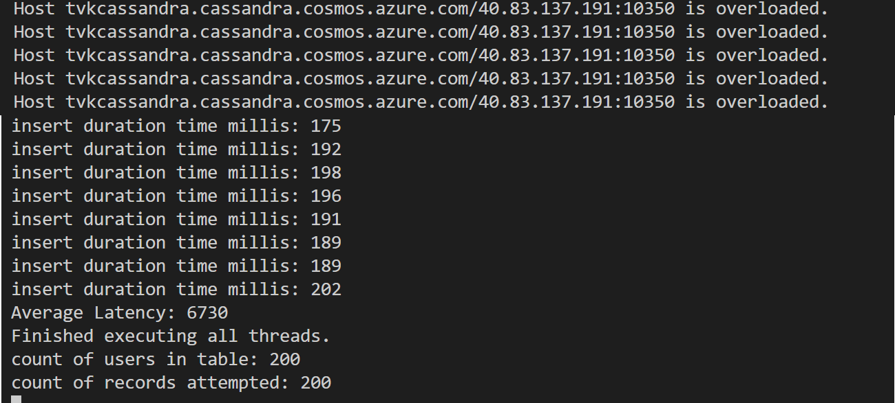

# Handling rate limited requests in the Azure Cosmos DB API for Cassandra
Azure Cosmos DB is a globally distributed multi-model database. One of the supported APIs is the Cassandra API. This sample illustrates how to handle rate limited requests. These are also known as [429 errors](https://docs.microsoft.com/rest/api/cosmos-db/http-status-codes-for-cosmosdb), and are returned when the consumed throughput exceeds the number of [Request Units](https://docs.microsoft.com/azure/cosmos-db/request-units) that have been provisioned for the service. 

In this code sample, we implement the [Azure Cosmos DB extension for Cassandra Retry Policy](https://github.com/Azure/azure-cosmos-cassandra-extensions) and build the extension using jitpack.io (see pom.xml file). The retry policy handles onRequestErrors such as OverLoadedError, and parses the exception message to use RetryAfterMs field provided from the server as the back-off duration. If RetryAfterMs is not available, we default to an exponential growing back-off scheme. In this case the time between retries is increased by a growing back off time (default: 1000 ms) on each retry, unless maxRetryCount is -1, in which case we back-off with fixed duration. This a similar approach to that implemented in the built-in [getRetryAfterInMilliseconds](https://docs.microsoft.com/java/api/com.microsoft.azure.documentdb.documentclientexception.getretryafterinmilliseconds?view=azure-java-stable) method in the Java SDK for [Azure Cosmos DB SQL API](https://docs.microsoft.com/en-us/azure/cosmos-db/sql-api-java-get-started). It is important to handle rate limiting in Azure Cosmos DB.

## Prerequisites
* Before you can run this sample, you must have the following prerequisites:
    * An active Azure Cassandra API account - If you don't have an account, refer to the [Create Cassandra API account](https://aka.ms/cassapijavaqs).
    * [Java Development Kit (JDK) 1.8+](http://www.oracle.com/technetwork/java/javase/downloads/jdk8-downloads-2133151.html)
        * On Ubuntu, run `apt-get install default-jdk` to install the JDK.
    * Be sure to set the JAVA_HOME environment variable to point to the folder where the JDK is installed.
    * [Download](http://maven.apache.org/download.cgi) and [install](http://maven.apache.org/install.html) a [Maven](http://maven.apache.org/) binary archive
        * On Ubuntu, you can run `apt-get install maven` to install Maven.
    * [Git](https://www.git-scm.com/)
        * On Ubuntu, you can run `sudo apt-get install git` to install Git.

## Running this sample
1. Clone this repository using `git clone git@github.com:Azure-Samples/azure-cosmos-db-cassandra-java-retry-sample.git cosmosdb`.

2. Change directories to the repo using `cd cosmosdb/java-examples`

3. Next, substitute the Cassandra host, username, password  `java-examples\src\main\resources\config.properties` with your Cosmos DB account's values from connectionstring panel of the portal.

    ```
    cassandra_host=<FILLME>
    cassandra_username=<FILLME>
    cassandra_password=<FILLME>
    ssl_keystore_file_path=<FILLME>
    ssl_keystore_password=<FILLME>
    ```
    If ssl_keystore_file_path is not given in config.properties, then by default <JAVA_HOME>/jre/lib/security/cacerts will be used. If ssl_keystore_password is not given in config.properties, then the default password 'changeit' will be used

5. Run `mvn clean install` from java-examples folder to build the project. This will generate cosmosdb-cassandra-examples.jar under target folder.
 
6. Run `java -cp target/cosmosdb-cassandra-examples.jar com.azure.cosmosdb.cassandra.examples.UserProfile` in a terminal to start your java application. The output will include a number of "overloaded" (rate limited) requests, the number of users present in the table after the load test, and the number of user inserts that were attempted. The two numbers should be identical since rate limits have been succesfully handled and retried.

   


## About the code
The code included in this sample is a load test to simulate a scenario where Cosmos DB will rate limit requests (return a 429 error) because there are too many requests for the [provisioned throughput](https://docs.microsoft.com/azure/cosmos-db/how-to-provision-container-throughput) in the service. In this sample, we create a Keyspace and table, and run a multi-threaded process that will insert users concurrently into the user table. To help generate random data for users, we use a java library called "javafaker", which is included in the build dependencies. The loadTest() will eventually exhaust the provisioned Keyspace RU allocation (default is 400RUs). 

In a real world scenario, you may wish to take steps to increase the provisioned throughput when the system is experiencing rate limiting. Note that you can do this programmatically in the Azure Cosmos DB API for Cassandra by executing [ALTER commends in CQL](https://docs.microsoft.com/azure/cosmos-db/cassandra-support#keyspace-and-table-options). In production, you should handle 429 errors in a similar fashion to this sample, and monitor the system, increasing throughput if 429 errors are being returned.

You should ensure that you account for [query idempotence](https://docs.datastax.com/en/developer/java-driver/3.0/manual/idempotence/), and the relevant rules for [retries](https://docs.datastax.com/en/developer/java-driver/3.0/manual/retries/#retries-and-idempotence). You should perform sufficient load testing to ensure that the implementation meets your requirements.

## Review the code

You can review the following files: `src/main/java/com/azure/cosmosdb/cassandra/util/CassandraUtils.java` and `src/main/java/com/azure/cosmosdb/cassandra/repository/UserRepository.java` to understand how sessions and retry policy is being created. Please note also that we set also timeout limits:

```java
        SocketOptions options = new SocketOptions();
        options.setConnectTimeoutMillis(30000);
        options.setReadTimeoutMillis(30000);

```

You should also consult the [Azure Cosmos DB extension for Cassandra Retry Policy](https://github.com/Azure/azure-cosmos-cassandra-extensions) if you want to understand how retry policy is implemented.

## More information

- [Azure Cosmos DB](https://docs.microsoft.com/azure/cosmos-db/introduction)
- [Java driver Source](https://github.com/datastax/java-driver)
- [Java driver Documentation](https://docs.datastax.com/en/developer/java-driver/)
